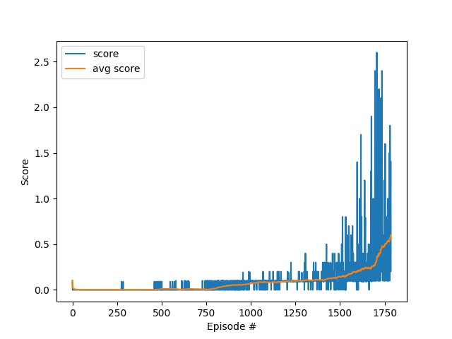

## Introduction
[MADDPG](https://arxiv.org/abs/1706.02275) is used to solve the Tennis problem with continuous control. The repository is structured as follows:

- `tennis.py`: This is the main python script for training and demonstrating the MADDPG algorithm

- `model.py`: The pytorch implementation of the Actor and Critic Networks

- `ddpg_agent`: The implementation of [DDPG](https://arxiv.org/abs/1509.02971) agent

- `maddpg.py`: The implementation of the MADDPG algorithm where DDPG is used for each agent

- `replay_buffer.py`: The implementation of replay memory for MADDPG training

## Algorithm
### DDPG
DDPG is first introduced since it's the underlying agent used by the MADDPG algorithm. It can be seen as an extension of DQN that can be applied to continuous action problems. It is an Actor-Critic method with the following characteristics:
- __Critic Network__: The critic is a network that takes the state-action pair and outputs the estimated Q-value. 
- __Actor Network__: As opposed to the vanilla DQN where the action maximizing the Q-value is picked from the discrete action space, DDPG uses a network to approximate the maximizer. The actor network takes the current state and outputs the continuous action that is supposed to give the max Q-value. Since the actor and critic networks are concatenated together, the training of the actor is done by maximizing the critic's value and back-propagating the gradients from the critic to the actor network.
### MADDPG
MADDPG is a multi-agent extension of DDPG, which is an Actor-Critic method. It utilized the followig techniques to achieve this:
- __Centralized Training, Decentralized Execution__: Each agent has its own actor and critic networks. The actor network considers only the state observed by the agent and outputs the action. On the other hand, the critic network considers the states observed by all agents and the actions taken by all agents. The critic then uses the global information to estimate the Q-value of the agent's own action. By assigning each agent its own critic, MADDPG can be easily applied to either competitive or cooperative problems since the critic is solely responsible for its agent's success.

### Ornstein-Uhlenbeck Process (OU Noise)
Similar to the DDPG paper, OU noise is added to during training to facilitate exploration, which seems important to this Tennis problem at the beginning of training. It has a drift term (controlled by ou_theta) and a diffusion term (controlled by ou_sigma). In contrast to Gaussian noise, OU noise is time-correlated and tends to generate more smooth noise, which is more suitable for environments with inertia. The noise is scaled down over episodes gradually to decrease the exploration behavior.

Hyperparameters:
- actor network
    - input: 24 units -> state size
    - fc1: 256 units (ReLU)
    - fc2: 128 units (ReLU)
    - fc4: 2 units (Tanh) -> action size
- critic network
    - input: 2*24 + 2*2 units -> global state + action size
    - fc1: 256 units (ReLU) -> only the global state is fed to fc1
    - fc2: 128 units (ReLU) -> takes the output of fc1 and the global action as the input 
    - fc4: 1 units (Linear) -> q-value of the global state-action pair
- gamma (discount factor): 0.99
- actor learning rate: 1e-4
- critic learning rate: 1e-4
- tau (soft update ratio): 1e-2
- n_episodes: 3000
- steps_per_update: 1
- replay memory
    - buffer size: 100000
    - batch size = 128
- OU noise
    - ou_scale = 1.0     -> initial scaling factor
    - ou_decay = 0.9995  -> decay of the scaling factor ou_scale
    - ou_mu = 0.0        -> asymptotic mean of the noise
    - ou_theta = 0.15    -> magnitude of the drift term
    - ou_sigma = 0.20    -> magnitude of the diffusion term

## Result
The goal average score is increased from +0.5 to +0.6 to see the potential of the agents.

```
Environment solved in 1785 episodes!    Average Score: 0.60
```


## Future Work
- __Hyperparameter Tuning__: The current setting requires almost 2000 episodes to achieve the goal. Finding better hyperparameters would be desired.
- __Change Reward Structure__: The two DDPG agents now only try to avoid letting the ball hit the ground or fall out of bounds. They don't care if their hits will let the other hit back easily. A better cooperation could be achieved by making the both agents consider the global reward.
- __Decentralized Agents__: MADDPG uses the global stata-action pair. It would be interesting to see how completely decentralized DDPG agents would perform in this task.
